# Docker


### NameSpace 

虚拟机都是独立操作系统有独立的进程 网络 存储 等等

一个宿主机上要运行多个容器，容器公用宿主机 必然引发一些问题

如何保证每个容器都有不同的文件系统 且互不影响

一个Dockerd主进程里 每个容器都是一个子进程，那么如何实现每个子进程下不同容器的子进程

IP端口  主机名   每个容器用户管理

  

每个容器都有自己的命名空间其中包括

MNT namespace 每个容器都有自己的根目录  不受影响比如你是/data 我也是/data 我们都往里面写 但是不合乎干扰

IPC Namespace  提供进程间通信的隔离 一个容器内有多个程序 间通讯消息队列共享内存都是独立的

PID Namespace 进程间编号隔离的  各是各的

 UTS Namespace 内核  主机名 域名 隔离

Network Namespace  ip  端口  

用户名 用户ID


高级运行时和低级运行时  runc containerd

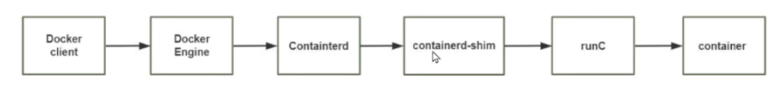


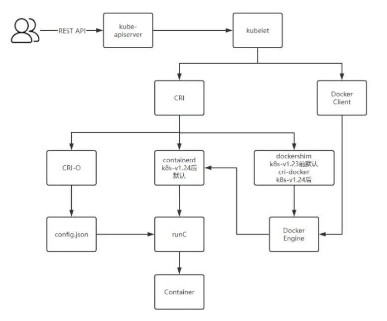


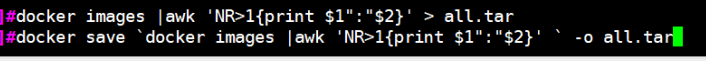


## 内容概述

​	容器化和虚拟机特性

​	Docker 介绍和安装 

​	Docker 基本操作  容

​	器镜像制作和管理  

​	数据卷管理  

​	网络管理  

​	容器编排管理

​	Docker Compose 

​	镜像仓库管理

​	容器资源限制


# 1 Docker 介绍和基础操作

Container 即容器，平时生活中指的是可以容纳其它物品的工具， 以方便人类归纳放置物品 、存储和异 地运输 ，比如人们使用的衣柜 、行李箱、 背包等 Container 还有另一个意思是集装箱, 很多码头工人将很多装有不同物品但却有标准尺寸的整齐划一的集 装箱装载到停靠在岸边大船，然后方便的运来运去。 早期海运成本远远高于铁路运输的，因为装卸的成本相当高，自从1946年美国人麦克莱恩发明了集装 箱，大大降低了成本，仅当于原来的百分五而已，成为当前成本最低的运输方式


```
早年搞运输特别麻烦，先要把各种货物，由经验丰富的老师傅，先估好尺寸，再尽可能地，把它们用最不占空
间的办法，地塞进卡车车厢。
货物到码头后，再由码头工人把货卸下来，然后让另一个经验丰富的老师傅，认真估好尺寸后，再用最不占空
间的办法，塞进船里。
船遇到其它港口后，卸货时，得再经过这么一个流程；之后卡车来装货，又得再经这么一个流程……怎么说呢？
整个过程不但烦死人，还时间特别长，费用特别高！到什么程度呢？
美国当时向巴西运无缝钢管，到巴西的价格，运费占了87%，只有13%才是造这种钢管的费用！
就在这时，有个人出现了，他是美国人，名叫麦克莱恩，搞运输出身的。他就琢磨着：干嘛要这么麻烦呢？
我把所有的东西，都装进一个箱子，运输前直接装上，在港口直接塞进船里，到港时直接卸下，然后放卡车直
接拖走，不就行了？
这东西叫什么呢？集装箱！
然后他就开始搞集装箱，还拼命推广它。
到1965年3月，机会来了：越南战争升级！
当时美国人的宣传机器，搞得挺牛叉：在越南岘港，美军第9海军陆战队远征军的士兵们，跳下登陆舰，然后带
着武器，涉水上岸。
一副重现二战胜利的架势！实际上呢？
当时这批登陆后的美军，其实背地里吵成一团：有的部队发现，他们的枪支到了，但弹药却不知道在哪里，而
按照命令，第二天他们就要开赴前线；还有的部队发现，他们的枪支没到，弹药到来了两份……怎么说呢？
到处都是乱糟糟，到处都是人在骂！
然后麦克莱恩就站出来了：这事我在行啊，我来承包啊，让我来运输，保证肯定不会发生这种事啊！怎么保证
呢？
就用他的集装箱，把一支部队要用的所有东西，统统都打好包，装进一个个集装箱，船运到越南后，用卡车直
接拉进营地，再打开再分！
果然效率大增！美军反响很好！
然后集装箱的名气就打响了，有些港口就尝试着，搞集装箱码头，船运公司则是搞集装箱专线。这一搞，就带
来了经济模式的转型：在出现大规模搞集装箱运输前，全世界的工业是分散的，一般来说，制造工厂和它的消
费市场之间，距离差不多在25英里，也就是40公里范围内。因为距离如果太长，在运输上，要不断地倒来倒
去，中间肯定会丢失、弄坏，还浪费时间，大大增加成本之类的一大堆，一般产品超过这个距离，就变得不划
算了！但搞了集装箱后，一切都变了！
人们可以在几千公里甚至上万公里之外，把东西造出来，然后装进集装箱，再运到发达国家的市场去卖！运输
成本很低！
于是一种新的经济模式就冒出来了：出口导向型经济！全世界最先搞这种经济模式的国家，是日本！
很少有人知道：在集装箱运输这种模式被采用前，搞出口导向型经济，因为成本太高，其实一点都不赚钱！
大家有空可以去看看日本1950到1960年代的贸易，会发现除了朝鲜战争那几年，日本是贸易顺差，其它年份
日本几乎全是逆差。
但日本没啥资源，就算是逆差，也得咬牙顶着。
当时甚至到了这种程度：1960年代初，有段时间，日本国内的白糖价格，远远高于国际市场价格，当时日本政
府公布政策，说哪家造船厂如果出口创汇多，政府就会按照比例，多给它免税进口白糖的配额！
造船厂接国外订单多，就有资格多进口白糖，挺搞笑的。
但随着集装箱运输的推广，日本经济开始快速膨胀：1966年超过法国；1967年超过英国；1968年超过联邦德
国，GDP成世界第二。
前面两次超越，大家都预测到了，但日本1968年就超过德国，有点出乎大家预料，因为很多人还觉得可能要到
1969年，或者1970年，日本才会超过德国。
但在当年9月，日本港口通向美国西海岸的集装箱联运开通，几乎一夜间，日本造的电视机、音响和微波炉，就
出现在美国超市的货架上，美国这方面的企业也几乎在一夜间，就溃不成军。
因为这条集装箱联线，是在当年9月才开的嘛，所以1968年日本对美国，贸易逆差还有1600万美元，但到了第
二年，日本就有了10亿美元的顺差。
之后更是一发而不可收拾，到1980年代，连美国国会议员们，都因为日本产品大举涌入，都公开掀桌子，当众
砸日本录音机了。
日本之后，东亚其它国家也都搞起出口导向型经济，甚至到了有段时间，“做外贸”成了“赚大钱”的另一个意
思
```


但今天我们所说的容器是一种 IT 技术。容器其实是一种沙盒技术。顾名思义，沙盒就是能够像一个集装 箱一样，把你的应用装起来。这样，应用与应用之间就有了边界而不会相互干扰;同时装在沙盒里面的应 用，也可以很方便的被搬来搬去，这也是 PaaS 想要的最理想的状态**(可移植性,标准化,隔离性)**。 容器是软件工业上的集装箱的技术，集装箱的标准化，减少了包装成本，大大提高货物运输和装卸效 率，是传统运输行业的重大变革。早期的软件项目中软件更新，发布低效，开发测试发布周期很长，很 难敏捷。有了容器技术，就可以利用其标准化的特点，大幅提高生产效率。 容器技术是虚拟化、云计算、大数据之后的一门新兴的并且是炙手可热的新技术， 容器技术提高了硬件 资源利用率、 方便了企业的业务快速横向扩容（可以达到秒级快速扩容）、 实现了业务宕机自愈功能  （配合K8S可以实现，但OpenStack无此功能），因此未来数年会是一个容器愈发流行的时代 ，这是 一 个对于 IT 行业来说非常有影响和价值的技术，而对于IT行业的从业者来说， 熟练掌握容器技术无疑是一 个很有前景的行业工作机会。


## 1.1 Docker 介绍

### 1.1.1 容器历史

虽然 docker 把容器技术推向了巅峰，但容器技术却不是从 docker 诞生的。实际上，容器技术连新技术 都算不上，因为它的诞生和使用确实有些年头了。下面的一串名称可能有的你都没有听说过，但它们的 确都是容器技术的应用:   

1、Chroot Jail 就是我们常见的 chroot 命令的用法。它在 1979 年的时候就出现了，被认为是最早的容器化技术之一。 它可以把一个进程的文件系统隔离起来。 

2、The FreeBSD Jail Freebsd Jail (监狱)实现了操作系统级别的虚拟化，它是操作系统级别虚拟化技术的先驱之一。2000年， 伴随FreeBSD4.0版的发布

 3、Linux VServer 使用添加到 Linux 内核的系统级别的虚拟化功能实现的专用虚拟服务器。允许创建许多独立的虚拟专用 服务器（VPS），这些虚拟专用服务器在单个物理服务器上全速同时运行，从而有效地共享硬件资源。 VPS提供与传统Linux服务器几乎相同的操作环境。可以在这样的VPS上启动所有服务（例如ssh，邮件， Web和数据库服务器），而无需（或者在特殊情况下只需进行很少的修改），就像在任何真实服务器上 一样。 每个VPS都有自己的用户帐户数据库和root密码，并且与其他虚拟服务器隔离，但它们共享相同的硬件 资源 2003年11月1日 VServer 1.0 发布 官网: http://linux-vserver.org/ 

4、Solaris Containers 它也是操作系统级别的虚拟化技术，专为 X86 和 SPARC 系统设计。Solaris 容器是系统资源控制和通过  "区域" 提供边界隔离的组合。

 5、OpenVZ OpenVZ 是一种 Linux 中操作系统级别的虚拟化技术。 它允许创建多个安全隔离的 Linux 容器，即  VPS。

 6、Process Containers Process 容器由 Google 的工程师开发，一般被称为 cgroups。 

7、LXC LXC为Linux Container的简写。可以提供轻量级的虚拟化，以便隔离进程和资源，而且不需要提供指令 解释机制以及全虚拟化的其他复杂性。容器有效地将由单个操作系统管理的资源划分到孤立的组中，以 更好地在孤立的组之间平衡有冲突的资源使用需求 Linux Container提供了在单一可控主机节点上支持多个相互隔离的server container同时执行的机制。 Linux Container有点像chroot，提供了一个拥有自己进程和网络空间的虚拟环境，但又有别于虚拟机， 因为lxc是一种操作系统层次上的资源的虚拟化。

 8、Warden 在最初阶段，Warden 使用 LXC 作为容器运行时。 如今已被 CloudFoundy 取代。

 9、LMCTFY LMCTY 是 Let me contain that for you 的缩写。它是 Google 的容器技术栈的开源版本。 Google 的工程师一直在与 docker 的 libertainer 团队合作，并将 libertainer 的核心概念进行抽象并移 植到此项目中。该项目的进展不明，估计会被 libcontainer 取代。 

10、Docker 2013年出现 Docker （码头工人）是一个可以将应用程序及其依赖打包到几乎可以在任何服务器上运行 的容器的工具。 

11、RKT RKT 是 Rocket 的缩写，它是一个专注于安全和开放标准的应用程序容器引擎。 综上所述正如我们所看到的，docker 并不是第一个容器化技术，但它的确是最知名的一个。


### 1.1.2 Docker 是什么

2010年，Solomon Hykes(Docker CTO)和几个年轻人在美国旧金山成立了一家 PaaS 平台的dotCloud 公司 , 此公司主要基于PaaS平台为开发者提供技术服务

Docker(码头工人) 是一个开源项目，诞生于 2013 年3月27日，最初是 dotCloud 公司（后由于 Docker  开源后大受欢迎在2013年10月就将公司改名为 Docker Inc ，总部位于美国加州的旧金山）内部的一个 开源的 PAAS 服务 (Platform as a ServiceService )的业余项目。它基于 Google 公司推出的 Go 语言实 现。 项目后来加入了 Linux 基金会，遵从了 Apache 2.0 协议，项目代码在 GitHub 上进行维护。

Docker 是基于 Linux 内核实现，Docker 最早采用 LXC 技术 ，LXC 是 Linux 原生支持的容器技术 ，可 以提供轻量级的虚拟化 ，可以说 docker 就是基于 LXC 发展起来 的，提供 LXC 的高级封装，标准的配 置方法，在LXC的基础之上，docker提供了一系列更强大的功能。而虚拟化技术 KVM(KernelKernel based Virtual Machine Machine) 基于模块实现， 后来Docker 改为自己研发并开源的 runc 技术运行容 器，彻底抛弃了LXC。

Docker 相比虚拟机的交付速度更快，资源消耗更低，Docker 采用客户端/服务端架构，使用远程API来 管理和创建容器，其可以轻松的创建一个轻量级的、可移植的、自给自足的容器，docker 的三大理念是 build(构建)、ship(运输)、 run(运行)，Docker遵从apache 2.0协议，并通过（namespace及cgroup 等）来提供容器的资源隔离与安全保障等，所以Docke容器在运行时不需要类似虚拟机（空运行的虚拟 机占用物理机6-8%性能）的额外资源开销，因此可以大幅提高资源利用率,总而言之Docker是一种用了 新颖方式实现的轻量级虚拟机.类似于VM但是在原理和应用上和VM的差别还是很大的，并且docker的专 业叫法是应用容器(Application Container)

**Docker 的主要目标**

Build, Ship and Run Any App, Anywhere，即通过对应用组件的封装（Packaging）、分发 （Distribution）、部署（Deployment）、运行（Runtime）等生命周期的管理，达到应用组件级别的 “一次封装，到处运行”。这里的应用组件，既可以是一个Web应用，也可以是一套数据库服务，甚至是 一个操作系统。将应用运行在Docker 容器上，可以实现跨平台，跨服务器，只需一次配置准备好相关的 应用环境，即可实现到处运行，保证研发和生产环境的一致性，解决了应用和运行环境的兼容性问题， 从而极大提升了部署效率，减少故障的可能性


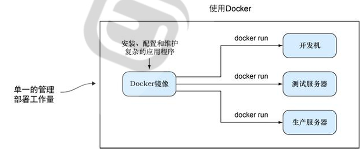

统一基础设施环境-docker环境 

硬件的组成配置 

操作系统的版本 

运行时环境的异构 

统一程序打包（装箱）方式-docker镜像 

java程序  python程序 nodejs程序  

统一程序部署（运行）方式-docker容器

 java -jar...→ docker run...

 python manage.py runserver... → docker run... 

npm run dev ... → docker run.


### 1.1.3 Docker 和虚拟机，物理主机

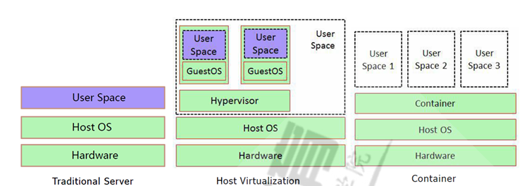


传统虚拟机是虚拟出一个主机硬件,并且运行一个完整的操作系统 ,然后在这个系统上安装和运行软 件

容器内的应用直接运行在宿主机的内核之上,容器并没有自己的内核,也不需要虚拟硬件,相当轻量化

每个容器间是互相隔离,每个容器内都有一个属于自己的独立文件系统,独立的进程空间,网络空间,用 户空间等,所以在同一个宿主机上的多个容器之间彼此不会相互影响

**容器和虚拟机比较**

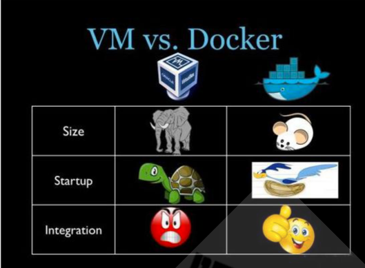

资源利用率更高:  开销更小,不需要启动单独的虚拟机OS内核占用硬件资源,可以将服务器性能压榨 至极致.虚拟机一般会有5-20%的损耗,容器运行基本无损耗,所以生产中一台物理机只能运行数十个 虚拟机，但是一般可以运行数百个容器

启动速度更快:  可以在数秒内完成启动

占用空间更小: 容器一般占用的磁盘空间以MB为单位,而虚拟机以GB

集成性更好:  和 CI/CD（持续集成/持续部署）相关技术结合性更好，实现打包镜像发布测试可以一 键运行,做到自动化并快速的部署管理,实现高效的开发生命周期

使用虚拟机是为了更好的实现服务运行环境隔离，每个虚拟机都有独立的内核，虚拟化可以实现不同操 作系统的虚拟机，但是通常一个虚拟机只运行一个服务，很明显资源利用率比较低且造成不必要的性能 损耗，我们创建虚拟机的目的是为了运行应用程序，比如Nginx、PHP、Tomcat等web程序，使用虚拟 机无疑带来了一些不必要的资源开销，而容器技术则基于减少中间运行环节带来较大的性能提升。

根据实验，一个运行着CentOS的KVM虚拟机启动后，在不做优化的情况下，虚拟机自己就需要占用 100~200 MB内存。此外，用户应用运行在虚拟机里面，它对宿主机操作系统的调用就不可避免地要经 过虚拟化软件的拦截和处理，这本身又是一层性能损耗，尤其对计算资源、网络和磁盘I/O的损耗非常 大。

比如:  一台96G内存的物理服务器，为了运行java程序的虚拟机一般需要分配8G内存/4核的资源，只能 运行13台左右虚拟机，但是改为在docker容器上运行Java程序,每个容器只需要分配4G内存即可，同样 的物理服务器就可以运行25个左右容器，运行数量相当于提高一倍，可以大幅节省IT支出，通常情况下 至少可节约一半以上的物理设备

### 1.1.4 Docker 的组成

docker 官网:   http://www.docker.com 帮助文档链接:   docker 镜像:     https://docs.docker.com/ https://hub.docker.com/ docker 中文网站:   http://www.docker.org.cn/

Docker 主机(Host):  一个物理机或虚拟机，用于运行Docker服务进程和容器，也称为宿主机， node节点

Docker 服务端(Server):  Docker守护进程，运行docker容器

Docker 客户端(Client):  客户端使用 docker 命令或其他工具调用docker API

 Docker 镜像(Images):  镜像可以理解为创建实例使用的模板,本质上就是一些程序文件的集合

Docker 仓库(Registry): 保存镜像的仓库，官方仓库:  https://hub.docker.com/，可以搭建私有仓库 harbor

 Docker 容器(Container): 容器是从镜像生成对外提供服务的一个或一组服务,其本质就是将镜像中 的程序启动后生成的进程

### 1.1.5 **Namespace**

```
https://man7.org/linux/man-pages/man7/namespaces.7.html
https://en.wikipedia.org/wiki/Linux_namespaces
```

一个宿主机运行了N个容器，多个容器共用一个 OS，必然带来的以下问题

​	怎么样保证每个容器都有不同的文件系统并且能互不影响？

​	一个docker主进程内的各个容器都是其子进程，那么如果实现同一个主进程下不同类型的子进程 各个容器子进程间能相互通信(内存数据)吗

​	每个容器怎么解决IP及端口分配的问题？

​	多个容器的主机名能一样吗？ 每个容器都要不要有root用户？怎么解决账户重名问题

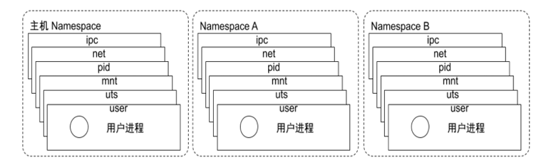

namespace是Linux系统的底层概念，在LInux内核层实现，即有一些不同类型的命名空间被部署在内 核，各个docker容器运行在同一个docker主进程并且共用同一个宿主机系统内核，各docker容器运行在 宿主机的用户空间，每个容器都要有类似于虚拟机一样的相互隔离的运行空间，但是容器技术是在一个 进程内实现运行指定服务的运行环境，并且还可以保护宿主机内核不受其他进程的干扰和影响，如文件 系统空间、网络空间、进程空间等，目前主要通过以下技术实现容器运行空间的相互隔离: 

| 隔离类型                                  | 功能                                                   | 系统调用参数 | 内核 版本 |
| ----------------------------------------- | ------------------------------------------------------ | ------------ | --------- |
| MNT Namespace(mount)                      | 提供磁盘挂载点和文件系统的 隔离能力                    |              |           |
| IPC Namespace(InterProcess Communication) | 提供进程间通信的隔离能力,包括信号量,消息队列和共享内存 |              |           |
| UTS Namespace(UNIX Timesharing System)    | 提供内核,主机名和域名隔离能力                          |              |           |
| PID Namespace(ProcessIdentification       | 提供进程隔离能力                                       |              |           |
| Net Namespace(network)                    | 提供网络隔离能力,包括网络 设备,网络栈,端口等           |              |           |
| User Namespace(user)                      | 提供用户隔离能力,包括用户 和组                         |              |           |

 **Pid namespace**

不同用户的进程就是通过Pid namespace 隔离开的，且不同namespace 中可以有相同Pid。

 有了Pid namespace, 每个namespace 中的Pid 能够相互隔离

**net namespace**

网络隔离是通过net namespace 实现的， 每个net namespace 有独立的network devices, IP  addresses, IP routing tables, /proc/net 目录。

Docker 默认采用veth 的方式将container 中的虚拟网卡同host 上的一个docker bridge: docker0  连接在一起。

**ipc namespace**

Container 中进程交互还是采用linux 常见的进程间交互方法（interprocess communication –  IPC）, 包括常见的信号量、消息队列和共享内存

container 的进程间交互实际上还是host上具有相同Pid namespace 中的进程间交互，因此需要在 IPC 资源申请时加入namespace 信息- 每个IPC 资源有一个唯一的32 位ID。

**mnt namespace**

 mnt namespace 允许不同namespace 的进程看到的文件结构不同，这样每个namespace 中的进 程所看到的文件目录就被隔离开了

**uts namespace**

UTS(“UNIX Time-sharing System”) namespace允许每个container 拥有独立的hostname 和 domain name, 使其在网络上可以被视作一个独立的节点而非Host 上的一个进程。

**user namespace**

每个container 可以有不同的user 和group id, 也就是说可以在container 内部用container 内部的 用户执行程序而非Host 上的用户。


### 1.1.6 Control groups

Linux Cgroups的全称是Linux Control Groups,是Linux内核的一个功能.最早是由Google的工程师（主 要是Paul Menage和Rohit Seth）在2006年发起，最早的名称为进程容器（process containers）。 在2007年时，因为在Linux内核中，容器（container）这个名词有许多不同的意义，为避免混乱，被重 命名为cgroup，并且被合并到2.6.24版的内核中去。自那以后，又添加了很多功能。 如果不对一个容器做任何资源限制，则宿主机会允许其占用无限大的内存空间，有时候会因为代码bug 程序会一直申请内存，直到把宿主机内存占完，为了避免此类的问题出现，宿主机有必要对容器进行资 源分配限制，比如CPU、内存等 Cgroups 最主要的作用，就是限制一个进程组能够使用的资源上限，包括CPU、内存、磁盘、网络带宽 等等。此外，还能够对进程进行优先级设置，资源的计量以及资源的控制(比如:将进程挂起和恢复等操 作)。 Cgroups在内核层默认已经开启，从CentOS 和 Ubuntu 不同版本对比，显然内核较新的支持的功能更 多。


# Docker 优化配置

注意：这种方式只对新建的容器有效的，之前的容器不生效

```bash
vim /etc/docker/daemon.json
{
  "registry-mirrors": [
  	"https://registry.docker-cn.com",
 	"http://hub-mirror.c.163.com",
 	"https://docker.mirrors.ustc.edu.cn",
 	"https://ohp72xxd.mirror.aliyuncs.com"  #换成自己的镜像加速地址
  ],
#开启远程:https://docs.docker.com/config/daemon/remote-access/
#ExecStart=/usr/bin/dockerd -H tcp://0.0.0.0:2375 -H fd:// 
	"hosts": ["unix:///var/run/docker.sock","tcp://10.0.0.10:2375"],
	"insecure-registries": ["harbor.wang.org"], #http私有仓库
	"exec-opts": ["native.cgroupdriver=systemd"],
	"graph": "/data/docker",  #指定docker数据目录,新版24.0.0不支持
	#ExecStart=/usr/bin/dockerd --data-root=/data/docker
	"max-concurrent-downloads": 10,
	"max-concurrent-uploads": 5,
	"log-opts": {
		"max-size": "300m",		#指定容器日志文件的最大值
		"max-file": "2",		#指定容器日志文件的个数，循环写入日志文件，即一个日志满，会写入第二个文件
	 },
	"live-restore": true,		#docker.service重启，不影响容器的运行
	"proxies": {				#代理 https://docs.docker.com/network/proxy/
	  "default": {
	  		 "httpProxy": "http://proxy.example.com:3128",
	  		 "httpsProxy": "https://proxy.example.com:3129",
	  		  "noProxy": "*.test.example.com,.example.org,127.0.0.0/8"
	  		      }
	  		  "tcp://docker-daemon1.example.com": {
	  		    "noProxy": "*.internal.example.net"
	  		    }
  }
}


https://ohp72xxd.mirror.aliyuncs.com


--replicate-do-table=mydatabase.mytable
```


Bootfs 内核

在镜像中时没有Bootfs 的 他没有自己独有的操作系统 所有容器加载宿主机的内核 只加载最小内核


 

```bash
docker -H 10.0.0.200 version
docker pull registry.cn-beijing.aliyuncs.com/wangxiaochun/alpine:3.11-v1

docker image prune -f   --all
默认删除虚玄镜像  --all删除所有 不使用的镜像

docker ps -a


docker tag busybox:latest www.zed.io/test/busybox:test
REPOSITORY                TAG       IMAGE ID       CREATED       SIZE
busybox                   latest    beae173ccac6   2 years ago   1.24MB
www.zed.io/test/busybox   test      beae173ccac6   2 years ago   1.24MB
nginx                     latest    605c77e624dd   2 years ago   141MB
alpine                    latest    c059bfaa849c   2 years ago   5.59MB


docker rmi  $(docker images -q)
docker rm $(docker ps -qa)

docker run busybox tail -f /dev/null #容器内要有个前台运行的进程

docker run -it --name qwer123  busybox

docker run --rm busybox ls /

docker run -d --name nginx --restart=always
Docker本身不会主动杀死后台运行的镜像实例，而是依赖于容器内运行的主进程。当容器内的主进程退出时，Docker就会认为容器任务完成，然后停止容器。
容器持续运行条件：
指定一个前台持续运行的进程做为容器启动默认命令

容器默认的资源限制 使用的是Dcoker进程 和Docker


[root@ubuntu2204 ~]#docker ps -qa|xargs docker rm -f 

attach 没有-it 选项 运行容器时要加上-it 才能使用attch 而是Attach 共享会话所有人用同一个窗口会导致互相干扰 而且退出容器就结束了  
exec  可以直接添加 -it 进入容器  窗口不会互相干扰 而且退出容器不会停止
docker exec -it nn1 sh -c "cat index.html"

dpkg -S /bin/ping
```


容器本身监听自己的IP端口   我们要想从外部访问要把端口暴露出去  也就是和宿主机端口进行关联 映射

```bash
镜像提前指定好的  -p宿主机端口随机  容器镜像提前定义好的 进行关联
docker run -P  --name nginx01  nginx:lates

最好使用指定端口暴露
 docker run  -p 81:80 --name nginx-test-port2 nginx
 docker run -d -p 80:80 --name nginx01 nginx
 
[root@ubuntu2204 ~]#docker exec -it nginx01 /bin/bash -c 'cat /etc/hosts'
docker exec -it --add-host www.zed.org:1.1.1.1 nginx01 /bin/bash -c 'cat /etc/hosts' xxx
docker run -it --add-host www.zed.org:1.1.1.1 nginx /bin/bash -c 'cat /etc/hosts'

docker cp /etc/apt/sources.list nginx01:/etc/apt/
docker cp nginx01:/etc/apt/sources.list .

#不能加 -d 不然前台没有标准输出
docker run --rm  --name env1 alpine  printenv  


docker run --name mysql -e MYSQL_ROOT_PASSWORD=123456 -e MYSQL_DATABASE=wordpress -e MYSQL_USER=zed -e MYSQL_PASSWORD=123456 -d -p 3306:3306 mysql
如果引用的变量太多我们可以定义在文件中
docker run --name mysql01 --env-file=env.txt -d -p 3306:3306 mysql
vim env.txt
MYSQL_ROOT_PASSWORD=123456
MYSQL_DATABASE=wordpress
MYSQL_USER=wpuser
MYSQL_PASSWORD=wppass


镜像也分层的 我们无法更改上一层的只读数据
我们只能在他的上面覆盖叠加，站在上帝视角我们只能把下面的数据复制上来修改覆盖
类似于写时辅助Cow 并不能直接修改下层的镜像层
每一条Dockerfile 就相当于一层 我们的命令只能在当前层使用 如果想修改只读层的内容是把他们复制上来修改的并不是直接在只读层更改 run 命令 && 写在一起


Dockerfile 不认绝对路径 而且涉及的到文件只能放在Dockerfile所在的目录下或子目录

多个CMD 只有最后一个生效


#基于容器导出文件  然后导入镜像
docker export mysql -o mysql.tar
docker import mysql.tar
```

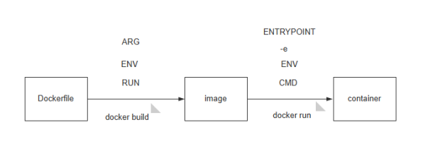

### 镜像经典概念

通常会涉及到镜像的两个主要层：只读层（Read-Only Layer）和读写层（Read-Write Layer）。这是容器技术中的写时复制（Copy-on-Write，COW）的一种应用。

具体流程如下：

1. **只读层（Read-Only Layer）**：这是容器的基础镜像层，包含文件系统和应用程序等。这一层是只读的，多个容器实例可以共享相同的只读层。
2. **读写层（Read-Write Layer）**：每个容器实例都有一个独立的读写层，用于存储容器运行时的变化和修改。初始时，这一层是空的。当容器内部的应用程序试图对只读层进行写操作时，COW技术会发挥作用。
   - 如果容器尝试修改只读层中的文件，系统会将要修改的文件复制到容器的读写层中，而不是直接修改只读层的文件。这确保了对容器的修改是独立的，不会影响其他容器实例。
   - 这种延迟复制的方式可以节省存储空间，因为多个容器实例可以共享相同的只读层，而它们的修改则存储在各自的读写层中。

这种COW技术的应用使得容器可以高效地共享基础镜像，同时保持容器实例之间的隔离。这是容器技术中提高效率和资源利用率的重要机制之一。


### ENV


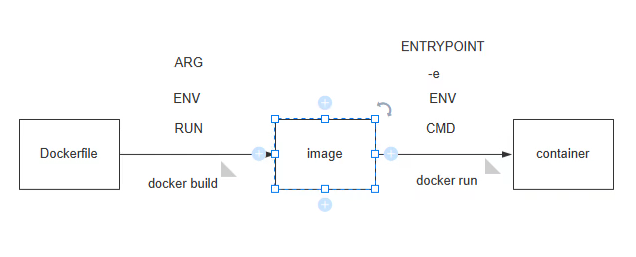

我们在写dockerfile时定义ENV Server=1 变量 然后调用它 创建一个文件

RUN touch ${SERVER}.txt   创建出来的文件名是 1.txt

他在创建镜像时调用的变量创建的，这时候文件已经创建出来了

等我们docker run -e Server=2  修改这个变量的值  虽然我们可以修改生效  但是文件名却还是1.txt

因为他是在创建镜像阶段调用的变量，我们是在运行容器时赋值，我们晚于镜像调用所以文件名不对

人家已经根据变量值创建好文件，文件已经创建好了 我们在修改变量 肯定是not vary


如果用户启动容器时用 docker run xxx 指定运行的命令，则会覆盖 CMD 指定的命令


### 制作镜像

```bash
先制作系统镜像(在原本镜像上优化环境) 分层是因为方便后续复用，做成一坨，后续要用还得重做
容器内对钟
本质上是把 /usr/share/zoneinfo/Asia/Shanghai 
文件软连接到 /etc/localtime -> /usr/share/zoneinfo/Asia/Shanghai
#两种办法
1 把宿主机上的这个文件拷贝到容器中创建ln 注意要在Dockerfile 同级目录下准备好时间文件
cp /usr/share/zoneinfo/Asia/Shanghai .
#相对路径，而且必须要在Dockerfile所在的目录之下 文件夹会自动创建
COPY Shanghai /usr/share/zoneinfo/Asia/Shanghai
RUN ln -s /usr/share/zoneinfo/Asia/Shanghai  /etc/localtime

#2 直接安装时间包 创建ln
dpkg -S /usr/share/zoneinfo/Asia/Shanghai  
apk add tzdate && ln -s /usr/share/zoneinfo/Asia/Shanghai  /etc/localtime
```


#### 优化基础镜像

```dockerfile
#在这里可以创建用户 给后续应用使用
FROM alpine:3.19

LABEL zuozhe=joker date=240122

RUN sed -i 's/dl-cdn.alpinelinux.org/mirrors4.tuna.tsinghua.edu.cn/' /etc/apk/repositories && apk update && \
apk add bash vim net-tools curl && addgroup -S -g 88 www && adduser -G www -u 88 -s /sbin/nologin -S www

COPY Shanghai /usr/share/zoneinfo/Asia/Shanghai
RUN ln -s /usr/share/zoneinfo/Asia/Shanghai  /etc/localtime
#基于alpine 他已经定义了CMD 我们可以不写
CMD ["/bin/bash"]


docker build . -t alpine:3.19-test
```

 

#### 应用镜像

```
apk --no-cache add gcc make  zip unzip pstree wget libgcc libc-dev libcurl libc-utils pcre-dev zlib-dev  libnfs  pcre pcre2 libevent libevent-dev iproute2

在Dockerfile目录下 准备好nginx二进制安装包 https://nginx.org/download/nginx-1.24.0.tar.gz
```


```dockerfile
FROM alpine:3.19-test
LABEL user=lxj
ENV NGINX_VERSION=1.24.0
EXPOSE 80 443

RUN apk update && apk --no-cache add gcc make  zip unzip pstree wget libgcc libc-dev libcurl libc-utils pcre-dev zlib-dev  libnfs

ADD nginx-${NGINX_VERSION}.tar.gz /usr/loacl/src

RUN cd /usr/local/src/nginx-${NGINX_VERSION} && ./configure --prefix=/usr/local/nginx && make && make install
COPY nginx.conf /usr/local/nginx/conf/nginx.conf
RUN echo 秒杀`date` >  /usr/local/nginx/html/index.html

CMD /usr/local/nginx/sbin/nginx -g "daemon off"

docker build -t alpine:3.19-test-nginx .
```


#### 业务镜像


默认执行是子进程  

exec 可以不关闭父进程  可以把父进程替换成 我后续要执行的进程 并且继承进程编号

1. **替换当前 Shell 进程：** 当你在Shell中执行 `exec` 命令时，它会取代当前 Shell 进程，使得新的命令成为该进程的内容。这意味着原始的 Shell 进程会被替代，而新的命令将取代它的位置。这通常用于在脚本或Shell会话中切换到不同的命令或程序。

   示例：

   ```
   bashCopy code
   exec command
   ```

   其中 `command` 是要执行的命令，它会取代当前 Shell 进程。

2. **重定向文件描述符：** `exec` 还可以用于重新定向Shell进程中的文件描述符。这可以用于修改输入、输出或错误的来源和目标。

   示例：

   ```
   bashCopy codeexec 3< input.txt  # 将文件 input.txt 的内容读入文件描述符 3
   exec 4> output.txt  # 将文件描述符 4 的输出重定向到 output.txt
   ```

   这个功能可以用于实现输入/输出的重定向和管道等操作。

- `$@` 是一个特殊的变量，在Shell脚本中表示所有的命令行参数。
- `exec` 是用于替换当前进程的命令，它接受命令并执行它，取代当前的Shell进程。

因此，`exec '$@'` 的作用是将脚本的所有命令行参数传递给一个`新的进程执行。这可以用于在脚本中将控制权转交给另一个命令或脚本，并将脚本的参数传递给这个新的命令或脚本。

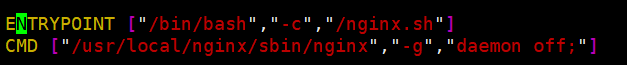

exec用来替换进程 

ENTRYPOINT 执行脚本 ---->  CMD 执行 启动nginx 的进程  不加exec '$@' 

那么ENTRYPOINT 后面就会多了一堆启动nginx的参数  1 脚本不能正常运行 2 nginx 无法启动 

bash /nginx.sh   /usr/local/nginx/sbin/nginx","-g","daemon off; 因为他俩并存CMD变成参数了 肯定不行


加exec '$@' 

在脚本的最后面加上exec '$@'    用谁替换nginx.sh？  用$@  谁是$@  CMD  而且CMD正好执行的是 nginx程序

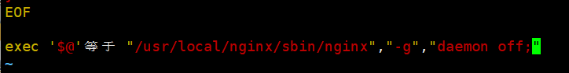

前面脚本执行完了 我要用一个程序替换 这个程序来源于我的参数 虽然我执行的时候没加参数

但 ENTRYPOINT 和 CMD 共存 CMD 就变成了 参数  

ENTRYPOINT nginx.sh 执行脚本 后面 跟着CMD  

等于 nginx.sh  exec    /usr/local/nginx/sbin/nginx","-g","daemon off


如果他俩并存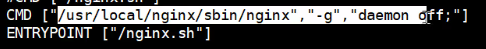 CMD变成参数了

 等于 ./ nginx.sh    /usr/local/nginx/sbin/nginx","-g","daemon off 

但是我们后面写了 exec "$@" 参数替换

最后变成   /usr/local/nginx/sbin/nginx","-g","daemon off   脚本执行完之后  被参数替换了 参数是命令程序

参数是CMD  

**如果CMD 和 entrypoint 同时存在 那么 CMD的指令会变成ENTRYPOINT的 参数**


```dockerfile
FROM alpine:3.19-test-nginx
COPY www.zed.org.conf /usr/local/nginx/conf/conf.d/www.zed.org.conf
COPY index.html  /data/html/index.html
COPY nginx.sh /

RUN  chmod +x /nginx.sh && chown -R www.www /data/html

ENTRYPOINT ["/nginx.sh"]
CMD ["/usr/local/nginx/sbin/nginx","-g","daemon off;"]
```


```shell
cat > /usr/local/nginx/conf/conf.d/www.zed.org.conf <<EOF
server  {
    listen 80;
    server_name ${SERVER_NAME:-www.zed.org};
    location / {
        root /data/html;
     }
}
EOF

exec "$@"
```


### 基于Ubuntu创建系统镜像

```dockerfile
FROM ubuntu:noble-20240114
LABEL user=zed
COPY sources.list /etc/apt/
RUN ["/bin/bash","-c","apt update","tcpdump lrzsz tree telnet bash-completion net-tools wget bzip2 lsof zip unzip nfs-common gcc make g++ libc6 libc-dev libpcre3 libpcre3-dev libssl-dev zlib1g zlib1g-dev libsystemd-dev"," rm -rf /etc/localtime"]

COPY Shanghai /usr/share/zoneinfo/Asia/Shanghai
RUN ln -s /usr/share/zoneinfo/Asia/Shanghai /etc/localtime &&  groupadd -g 88 web && useradd -r -M -s /sbin/nologin -u 88 -g web web

docker build -t ubuntu:2204-extend .
```


### 基于优化过的系统镜像 安装JDK

```bash
#将宿主机主机上的/etc/profile文件传到 Dockerfile所在目录下 修改文件加上tomcat JDK 环境变量
export JAVA_HOME=/usr/local/jdk
export TOMCAT_HOME=/apps/tomcat
export PATH=$JAVA_HOME/bin:$JAVA_HOME/jre/bin:$TOMCAT_HOME/bin:$PATH
export CLASSPATH=.$CLASSPATH:$JAVA_HOME/lib:$JAVA_HOME/jre/lib:$JAVA_HOME/lib/tools.jar
#在Dockerfile下准备JDK安装包
#准备Dockerfile
FROM ubuntu:2204-extend

ADD jdk-8u391-linux-x64.tar.gz /usr/local/src/
RUN ln -s /usr/local/src/jdk1.8.0_391 /usr/local/jdk
COPY profile  /etc/profile

ENV JAVA_HOME /usr/local/jdk
ENV JRE_HOME $JAVA_HOME/jre
ENV CLASSPATH $JAVA_HOME/lib/:$JRE_HOME/lib/
ENV PATH $PATH:$JAVA_HOME/bin

docker build -t ubuntu:2204-extend-jdk8 .

#基于jdk镜像运行 确认没问题
docker run -it --rm ubuntu:2204-extend-jdk8 bash
oot@2a8ecf47a6fc:/# java -version
java version "1.8.0_391"
Java(TM) SE Runtime Environment (build 1.8.0_391-b13)
Java HotSpot(TM) 64-Bit Server VM (build 25.391-b13, mixed mode)
```


####  从JDK镜像构建tomcat 8 

```dockerfile
FROM ubuntu:2204-extend-jdk8

ENV TZ "Asia/Shanghai" 
ENV LANG en_US.UTF-8
ENV CATALINA_HOME /apps/tomcat
ENV APP_DIR ${CATALINA_HOME}/webapps

RUN mkdir /apps
ADD apache-tomcat-8.5.98.tar.gz  /apps
RUN ln -s /apps/apache-tomcat-8.5.98 /apps/tomcat


docker build -t ubuntu:2204-extend-jdk8-tomcat8 .

#运行一下试试
docker run -it --rm -p 8080:8080 ubuntu:2204-extend-jdk8-tomcat8 bash
/apps/tomcat/bin/catalina.sh start
```


#### 基于tomcat8镜像构建业务镜像

```bash
cp 一份server.xml 到当前目录


mkdir myapp
echo 这是我第二个分层架构镜像tomcat > myapp/index.jsp
#把项目文件夹打包
tar zcf myapp.tar.gz myapp
```


```bash
#编写 entrypoint 脚本 
echo "nameserver 180.76.76.76" > /etc/resolv.conf
su - web -c "/apps/tomcat/bin/catalina.sh start"
exec "$@"
       

chmod +x tomcatentrypoit.sh 
```


```
FROM ubuntu:2204-extend-jdk8-tomcat8
COPY server.xml /apps/tomcat/conf/server.xml
COPY tomcatentrypoit.sh /apps/tomcat/bin/tomcatentrypoit.sh 
ADD  myapp.tar.gz /data/tomcat/webapps

RUN chown -R web:web  /apps/  /data/tomcat/

EXPOSE 8080

#ENTRYPOINT ["/apps/tomcat/bin/tomcatentrypoit.sh"] 
ENTRYPOINT ["/apps/tomcat/bin/tomcatentrypoit.sh"]
CMD ["/bin/bash","-c","tail -f /etc/hosts "]


docker build -t ubuntu:2204-extend-jdk8-web .
docker run -it --rm -p 8080:8080 ubuntu:2204-extend-jdk8-web
```


### 镜像优化多阶段构建

例子 GOLANG

```dockerfile
#传统方式
FROM ubuntu:22.04
COPY sources.list /etc/apt/sources.list
COPY hello.go  /golang/hello.go

RUN apt update && apt install -y golang && cd /golang && go build hello.go

CMD ["/golang/hello"]
```

构建出来的镜像1G 太大了 ，但其实编译后的go程序也就 2M

1. ubuntu镜像本身就很大‘ 70M
2. 为了编译go程序，我们安装了golang=900M

官网找golang官方的小镜像 因为官方专门制作的比我们做得小


```dockerfile
#优化1
#FROM ubuntu:22.04 
FROM  golang:alpine3.19

#COPY sources.list /etc/apt/sources.list
COPY hello.go  /golang/hello.go

#RUN apt update && apt install -y golang && cd /golang && go build hello.go
#官方替我们安装了我们就不用安装了 直接build就行
RUN cd /golang && go build hello.go

CMD ["/golang/hello"]        
```


实际上我们只是在编译的时候需要 golang程序，一但编译完成运行的时候并不需要

多阶段构建技术  编译的时候用golang:alpine3.19 镜像  我们把编译好的二进制文件COPY到小镜像中运行

golang:alpine3.19 只负责编译  编译废弃   用另一个小镜像运行二进制文件

```dockerfile
#优化2
#FROM ubuntu:22.04
FROM  golang:alpine3.19  

#COPY sources.list /etc/apt/sources.list
COPY hello.go  /golang/hello.go

#RUN apt update && apt install -y golang && cd /golang && go build hello.go
#官方替我们安装了我们就不用安装了 直接build就行
RUN cd /golang && go build hello.go
#CMD ["/golang/hello"]


FROM alpine:3.19
#前一次构建的结果放在了golang下hello 拷贝到当前镜像的golang下
COPY --from=0 /golang/hello /golang/hello
CMD ["/golang/hello"]
```


alpine:3.19虽然小但是还有更小的busybox 

```dockerfile
#优化3
#FROM ubuntu:22.04
FROM  golang:alpine3.19

#COPY sources.list /etc/apt/sources.list
COPY hello.go  /golang/hello.go

#RUN apt update && apt install -y golang && cd /golang && go build hello.go
#官方替我们安装了我们就不用安装了 直接build就行
RUN cd /golang && go build hello.go
#CMD ["/golang/hello"]


#FROM alpine:3.19
#FROM busybox:stable-musl
#这个镜像很小没有sh bash 进不去 看不了 也没有库如果是依赖库的程序要把库一起拷贝进去
FROM scratch


#前一次构建的结果放在了golang下hello 拷贝到当前镜像的golang下
COPY --from=0 /golang/hello /golang/hello
CMD ["/golang/hello"]

```


#### 示例二 NGINX

nginx是用C语音写的  单单拷贝一个编译后的二进制文件是运行不了的

```dockerfile
ARG VERSION=3.19
FROM alpine:$VERSION
LABEL maintainer="lixijun"
ENV NGINX_VERSION=1.24.0
ENV NGINX_DIR=/apps/nginx
RUN  sed -i 's/dl-cdn.alpinelinux.org/mirrors.ustc.edu.cn/' /etc/apk/repositories  && apk update && apk --no-cache add gcc build-base  make libgcc  libcurl libc-utils pcre-dev zlib-dev  libnfs pcre pcre2  net-tools curl pstree wget libevent libevent-dev iproute2 openssl-dev
ADD nginx-$NGINX_VERSION.tar.gz /usr/local/src
RUN cd /usr/local/src/nginx-$NGINX_VERSION && ./configure  --prefix=${NGINX_DIR} --user=nginx --group=nginx --with-http_ssl_module --with-http_v2_module --with-http_realip_module --with-http_stub_status_module --with-http_gzip_static_module --with-pcre --with-stream --with-stream_ssl_module --with-stream_realip_module && make && make install

COPY nginx.conf ${NGINX_DIR}/conf/nginx.conf


FROM alpine:$VERSION
ENV NGINX_DIR=/apps/nginx
COPY --from=0 ${NGINX_DIR}/ ${NGINX_DIR}/
RUN  sed -i 's/dl-cdn.alpinelinux.org/mirrors.ustc.edu.cn/' /etc/apk/repositories \
     && apk update && apk --no-cache add tzdata pcre pcre2 \
     && ln -s  /usr/share/zoneinfo/Asia/Shanghai /etc/localtime \
     && echo "Asia/Shanghai" > /etc/timezone \
     && ln -sf ${NGINX_DIR}/sbin/nginx  /usr/sbin/nginx \
     && addgroup -g 2019 -S nginx \
     && adduser  -u 2019 -G nginx -D -S -s /sbin/nologin nginx \
     && chown  -R  nginx.nginx  ${NGINX_DIR}/ \
     && ln -sf /dev/stdout ${NGINX_DIR}/logs/access.log \
     && ln -sf /dev/stderr ${NGINX_DIR}/logs/error.log
EXPOSE 80 443
CMD ["nginx","-g","daemon off;"]

```


数据卷

```bash 
#把宿主机的目录或文件挂载到容器内的某个目录 没有自动创建 Bind Mout
docker run -d -v /data:/volume --name demo wangxiaochun/pod-test:v0.1
docker run -d -v ./nginx.conf:/volume/nginx.conf --name demo wangxiaochun/pod-test:v0.1

#匿名卷和命名卷
不写宿主机路径   默认在这里生成匿名文件夹 ll /var/lib/docker/volumes/
docker run -d -v /usr --name demo wangxiaochun/pod-test:v0.1

docker run -d --name mysql -p 3306:3306 -e MYSQL_RANDOM_ROOT_PASSWORD=yes -v mysql:/var/lib/mysql mysql


docker run -p 3306:3306 -e MYSQL_ROOT_PASSWORD=123456 -e MYSQL_DATABASE=wordpress -e MYSQL_USER=wordpress -e MYSQL_PASSWORD=123456 --name mysql -d  -v /data/mysql:/var/lib/mysql --restart=always mysql:8.0.29-oracle

docker run -d -p 80:80 --name wordpress -v /data/wordpress:/var/www/html --restart=always  wordpress:php7.4-apache
不能填写localhost 是PHP自己的127 或者 自己的localhost


docker run -d --name server -v /etc:/data/ -v /boot:/data/ -v /dev:/data/  alpine:3.19

docker run -it --name client1 --volumes-from server alpine:3.19 sh
docker run -it --name client2 --volumes-from server alpine:3.19 sh
```


网络

我们可以让容器和容器之间禁止通讯，

```bash
docker run -d -e MYSQL_ROOT_PASSWORD=123456 -e MYSQL_DATABASE=wordpress -e MYSQL_USER=wordpress -e MYSQL_PASSWORD=123456 --name mysql  --restart=always mysql:8.0.29-oracle

docker run -d -p 80:80 --name wordpress  --link mysql --restart=always  wordpress:php7.4-apache


docker run -d --network host -e MYSQL_ROOT_PASSWORD=123456 -e MYSQL_DATABASE=wordpress -e MYSQL_USER=wordpress -e MYSQL_PASSWORD=123456 --name mysql  --restart=always mysql:8.0.29-oracle


docker run -d --network host --name wordpress   --restart=always  wordpress:php7.4-apache


#提前暴露80
docker run -d -p 80:80 -e MYSQL_ROOT_PASSWORD=123456 -e MYSQL_DATABASE=wordpress -e MYSQL_USER=wordpress -e MYSQL_PASSWORD=123456 --name mysql  --restart=always mysql:8.0.29-oracle
docker run -d --network container:mysql --name wordpress   --restart=always  wordpress:php7.4-apache


#不需要 --link mysql  直接靠名字就可以访问
docker network create -d bridge --subnet 192.168.66.0/24 --gateway 192.168.66.100  wp

docker run -d -p 80:80 --network wp --name wordpress   --restart=always  wordpress:php7.4-apache

```


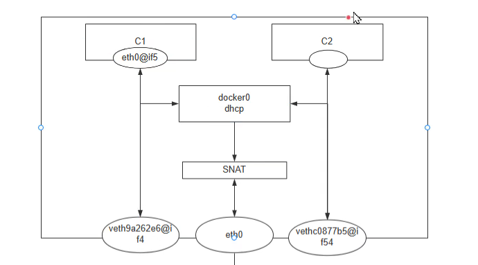


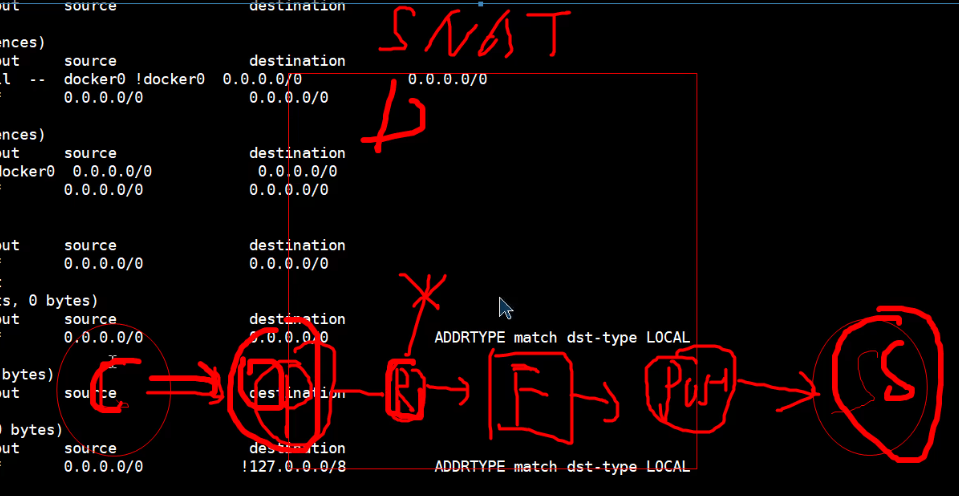


 


```bash
docker network create -d bridge --subnet 192.168.100.0/24 --gateway 192.168.100.1  net1
docker network create -d bridge --subnet 192.168.200.0/24 --gateway 192.168.200.1  net2


docker run -d --network net1 --name wordpress --restart=always  wordpress:php7.4-apache
docker run -d --network net2  --name nginx nginx:1.24

docker run -d --network net2  -e MYSQL_ROOT_PASSWORD=123456 -e MYSQL_DATABASE=wordpress -e MYSQL_USER=wordpress -e MYSQL_PASSWORD=123456 --name mysql  --restart=always 


```


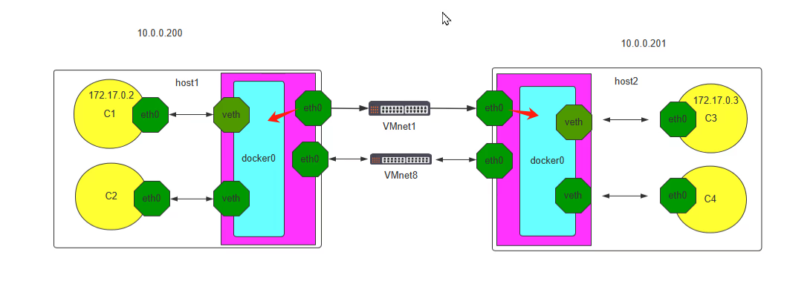


```yaml
name: wordpress
services:
    wordpress:
        ports:
            - 8080:80
        networks:
            - bridge2
        container_name: wordpress
        volumes:
            - /data/wordpress:/var/www/html
        restart: always
        image: wordpress:php7.4-apache
    mysql:
        networks:
            - bridge2
        environment:
            - MYSQL_ROOT_PASSWORD=123456
            - MYSQL_DATABASE=wordpress
            - MYSQL_USER=wordpress
            - MYSQL_PASSWORD=123456
        container_name: mysql2
        volumes:
            - /data/mysql:/var/lib/mysql
        restart: always
        image: mysql:8.0.29-oracle
networks:
    bridge2:
        external: true
        name: bridge2

```


去每个项目下运行docker-compoes


不能加端口 不然会报错

目标名就是项目名称

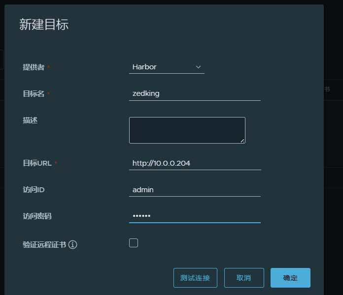


用nginx反向代理的方式实现https

要在nginx代理服务器上配置https证书

```bash
cat www.zed.io.crt ca.crt > www.zed.io.pem


两个报错注意
1. 证书缺少 V3信息  CA签发的时候添加v3文件

2. Ca.不受信
curl -v https://www.zed.io
查到路径 把我们的CA证书添加进去
#将私有CA的证书加入到每个docker主机的上信任证书CA列表中
#在Harbor服务器执行
#Ubuntu
 cat /data/harbor/certs/ca.crt >> /etc/ssl/certs/ca-certificates.crt
 #红帽系统
cat /data/harbor/certs/ca.crt >> /etc/pki/tls/certs/ca-bundle.crt
#将上面的文件复制到所有docker主机覆盖原文件
#并将所有docker主机的docker服务重启生效
systemctl restart docker.service

3. 解决证书信任的第二种办法
#此步可选
#转换harbor的crt证书文件为cert后缀,docker识别crt文件为CA证书,cert为客户端证书
转换其实就是换了个文件名其实内容都一样 而且官方说要拷贝三个文件其实拷贝www.zed.io.crt文件即可
openssl x509 -inform PEM -in harbor.wang.org.crt -out harbor.wang.org.cert
 #或者
cp -a harbor.wang.org.crt  harbor.wang.org.cert
 #比较两个文件的不同 其实一模一样
md5sum harbor.wang.org.crt harbor.wang.org.cert

#创建和harbor服务器同名的目录
mkdir -pv /etc/docker/certs.d/www.zed.io/
 #如果使用containerd运行时
mkdir -pv /etc/containerd/certs.d/www.zed.io/
 #在docker客户端使用上面的证书文件
#注意:官方介绍需要同时复制harbor.wang.org.key ca.crt,实际不需要
cp harbor.wang.org.cert或harbor.wang.org.crt  harbor.wang.org.key ca.crt 
/etc/docker/certs.d/harbor.wang.org/
 #注意:实际只需要拷贝下面一个文件即可
cp harbor.wang.org.crt /etc/docker/certs.d/harbor.wang.org/
 #无需重启服务，Docker客户即可上传下载镜像
#新版如果无法登录,需重启docker服务
systemctl restart docker
```

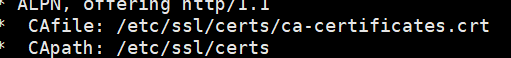


### 基于nginx反向代理实现 https harbor

```bash
#自建CA 并签发证书
#创建证书相关数据的目录
mkdir -p /data/harbor/certs
cd /data/harbor/certs
#生成ca的私钥
openssl genrsa -out ca.key 4096
#生成ca的自签名证书
openssl req -x509 -new -nodes -sha512 -days 3650 \-subj "/C=CN/ST=Beijing/L=Beijing/O=example/OU=Personal/CN=ca.lxj.org" \
-key ca.key \
-out ca.crt

#生成harbor主机的私钥
openssl genrsa -out www.zed.io.key 4096
#生成harbor主机的证书申请，注意：CN的名称一定是访问harbor的主机域名
openssl req -sha512 -new \
-subj "/C=CN/ST=Beijing/L=Beijing/O=example/OU=Personal/CN=www.zed.io" \
-key harbor.wang.org.key \
-out harbor.wang.org.csr

#创建x509 v3 扩展文件(新版新增加的要求) 
cat > v3.ext <<-EOF
authorityKeyIdentifier=keyid,issuer
basicConstraints=CA:FALSE
keyUsage = digitalSignature, nonRepudiation, keyEncipherment, dataEncipherment
extendedKeyUsage = serverAuth
subjectAltName = @alt_names
[alt_names]
DNS.1=www.zed.io     #此处必须和和harbor的网站名称一致
DNS.2=wang                 #可选
DNS.3=wang.org             #可选
EOF
 
#给 harbor主机颁发证书
openssl x509 -req -sha512 -days 3650 \
-extfile v3.ext \
-CA ca.crt -CAkey ca.key -CAcreateserial \
-in www.zed.io.csr \
-out www.zed.io.crt

#查看添加V3信息的证书
openssl x509 -in /data/harbor/cerst/www.zed.io.csr  
#最终文件列表如下 
ca.crt  ca.key  ca.srl  harbor.wang.org.crt  harbor.wang.org.csr  
harbor.wang.org.key  v3.ext
```

注意: 如果不生成创建x509 v3 扩展文件,会出现下面提示错误

```
ocker login harbor.wang.org
 Username: admin
 Password: 
Error response from daemon: Get "https://harbor.wang.org/v2/": x509: certificate 
relies on legacy Common Name field, use SANs or temporarily enable Common Name 
matching with GODEBUG=x509ignoreCN=0
```


#用户到nginx走 https  有nginx 用http 反向代理到后端

这样我们后端 harbor 用http就行

```bash
upstream harbor {
    hash $remote_addr;
    server 10.0.0.205;
    server 10.0.0.204;
}

server{
    listen 80;
    listen 443 ssl;
    ssl_certificate  /data/harbor/certs/www.zed.io.pem;
    ssl_certificate_key /data/harbor/certs/www.zed.io.key;
    server_name www.zed.io;
    client_max_body_size 1g;


    if ($scheme != https) {
        rewrite .*  https://$host$request_uri permanent;
    }

    location / {
      proxy_pass http://harbor;
}

}
```


### 直接在harbor服务器上配置https

```bash
#自建CA 并签发证书
#创建证书相关数据的目录
mkdir -p /data/harbor/certs
cd /data/harbor/certs
#生成ca的私钥
openssl genrsa -out ca.key 4096
#生成ca的自签名证书
openssl req -x509 -new -nodes -sha512 -days 3650 \-subj "/C=CN/ST=Beijing/L=Beijing/O=example/OU=Personal/CN=ca.lxj.org" \
-key ca.key \
-out ca.crt

#生成harbor主机的私钥
openssl genrsa -out www.zed.io.key 4096
#生成harbor主机的证书申请，注意：CN的名称一定是访问harbor的主机域名
openssl req -sha512 -new -subj "/C=CN/ST=Beijing/L=Beijing/O=example/OU=Personal/CN=www.zed.io" -key www.zed.io.key -out www.zed.io.csr

#创建x509 v3 扩展文件(新版新增加的要求) 
cat > v3.ext <<-EOF
authorityKeyIdentifier=keyid,issuer
basicConstraints=CA:FALSE
keyUsage = digitalSignature, nonRepudiation, keyEncipherment, dataEncipherment
extendedKeyUsage = serverAuth
subjectAltName = @alt_names
[alt_names]
DNS.1=www.zed.io     #此处必须和和harbor的网站名称一致
DNS.2=wang                 #可选
DNS.3=wang.org             #可选
EOF
 
#给 harbor主机颁发证书
openssl x509 -req -sha512 -days 3650 \
-extfile v3.ext \
-CA ca.crt -CAkey ca.key -CAcreateserial \
-in www.zed.io.csr \
-out www.zed.io.crt
#新版的最终文件列表如下
ca.crt  ca.key  v3.ext  www.zed.io.crt  www.zed.io.csr  www.zed.io.key

```


#### 修改harbor配置文件使用Https服务 并调用证书文件

```bash
/data/harbor/certs/www.zed.io.crt  #此证书是包含 v3认证的
/data/harbor/certs/www.zed.io.key  

./prepare  重新生成compose 文件
#重启服务
docker-compose down
docker-compose up -d
```

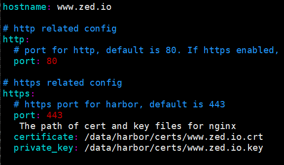


```bash
#配置完之后，客户端如果想使用，就必须要信任我们的CA 有两种办法 添加完记得重启服务
1. 把我们的ca.crt拷贝到客户端 并添加到受信文件中
#将私有CA的证书加入到每个docker主机的上信任证书CA列表中
#在Harbor服务器执行
#Ubuntu
 cat /data/harbor/certs/ca.crt >> /etc/ssl/certs/ca-certificates.crt
 #红帽系统
cat /data/harbor/certs/ca.crt >> /etc/pki/tls/certs/ca-bundle.crt
 #将上面的文件复制到所有docker主机覆盖原文件
#并将所有docker主机的docker服务重启生效
systemctl restart docker.servic

2. 按照官方的步骤把我们的证书拷贝到客户端并创建对应的目录
#转换harbor的crt证书文件为cert后缀,docker识别crt文件为CA证书,cert为客户端证书
openssl x509 -inform PEM -in harbor.wang.org.crt -out harbor.wang.org.cert
 #或者
cp -a harbor.wang.org.crt  harbor.wang.org.cert
 #比较两个文件的不同
md5sum harbor.wang.org.crt harbor.wang.org.cert
 #创建和harbor服务器同名的目录
mkdir -pv /etc/docker/certs.d/harbor.wang.org/
 #如果使用containerd运行时
mkdir -pv /etc/containerd/certs.d/harbor.wang.org/
 #在docker客户端使用上面的证书文件
#注意:官方介绍需要同时复制harbor.wang.org.key ca.crt,实际不需要
cp harbor.wang.org.cert或harbor.wang.org.crt  harbor.wang.org.key ca.crt 
/etc/docker/certs.d/harbor.wang.org/
 #注意:实际只需要拷贝下面一个文件即可
cp harbor.wang.org.crt /etc/docker/certs.d/harbor.wang.org/
 #无需重启服务，Docker客户即可上传下载镜像
#新版如果无法登录,需重启docker服务
systemctl restart docker
```


```bash
#关闭交换分区
systemctl status  swap.img.swap
systemctl status  swap.target

systemctl disable --now   swap.target 
systemctl mask  swap.target
swapoff -a


docker run --rm  --name dome1 -m 1g lorel/docker-stress-ng --vm 100
docker run --rm  --name dome1 --cpus 0.5 --cpuset-cpus 0  lorel/docker-stress-ng --cpu 2
它可能时用时间片 不是完全用用一个cpu
```


# Docker网络

容器和容器之间通过名称或自定义别名实现的互联，仅限于单机Docker主机使用，用得不多

同一个Docker网桥中的容器 其实是靠Mac地址通讯的，容器1 发送报文到 网桥，然后网桥发apr广播获得对方的Mac

桥接模式（默认创建模式）：

host模式：

​		--nat=host 容器不会创建网络堆栈信息，而是直接使用宿主机的网络堆栈，进行通信

不需要报文转发，性能好，通常用于网络性能要求比较高的业务，mysql、kafka、redis、

Container模式：
