写 先写mysql  然后写到 redis


读 先查redis redis没有 查mysql  mysql查到了 之后写到redis  redis返回结果 这样redis也有没有的数据了


同一个客户端请求10个数据，发送1 返回结果 发送2 返回结果 直到10次完成

Pipeniln  同一个客户端请求10个数据，直接把10个请求的结果一次性都返回，执行10次查询后，结果统一返回

对用户来说会慢一点，但提高了网络利用率


```bash
#依赖
apt update &&  apt install make gcc libjemalloc-dev  libsystemd-dev
#下包
#解压
mkdir /apps
tar xf redis-7.2.4.tar.gz
cd redis-7.2.4/
#编译
make -j2 USE_SYSTEMD=yes PREFIX=/apps/redis install
#缺少部分目录
mkdir /apps/redis/{conf,log,run,data} -p
[root@ubuntu2204 ~]#tree /apps/redis/
/apps/redis/
├── bin
│   ├── redis-benchmark
│   ├── redis-check-aof -> redis-server
│   ├── redis-check-rdb -> redis-server
│   ├── redis-cli
│   ├── redis-sentinel -> redis-server
│   └── redis-server
├── conf
│   └── redis.conf
├── data
├── log
└── run

#cp源码中的配置文件到安装目录  文件有问题要修改
cp redis.conf /apps/redis/conf/redis.conf

#添加PATH变量 方便调用目录
echo "PATH=/apps/redis/bin/:$PATH" > /etc/profile.d/redis.sh
. /etc/profile.d/redis.sh
#创建专用用户
useradd -r -s  /sbin/nologin -d /apps/redis/ -M redis
#把redis的安装目录都加上redis用户权限
chown -R redis.redis /apps/redis/
```


```bash
#写service文件方便开启启动
[Unit]
Description=Advanced key-value store
After=network.target
Documentation=http://redis.io/documentation, man:redis-server(1)

[Service]
ExecStart=/apps/redis/bin/redis-server /apps/redis/conf/redis.conf --supervised systemd 
ExecStop=/bin/kill -s QUIT $MAINPID
User=redis
Group=redis
Type=notify
RuntimeDirectory=redis
RuntimeDirectoryMode=0755
LimitNOFILE=1000000

[Install]
WantedBy=multi-user.target
```


# 三个warning原因及优化

全连接队列
ubuntu 新内核默认 4096

```bash
#查看
cat /proc/sys/net/core/somaxconn
sysctl -a |  grep somaxconn
#修改
vim /etc/sysctl.conf
sysctl -p
```

第三次握手之后有一个短暂的连接

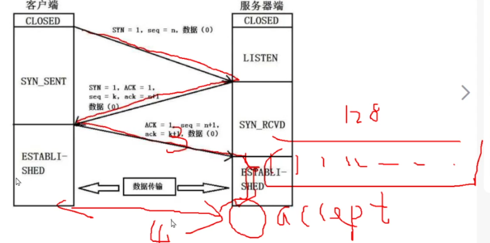


**内存申请**

假如物理 16G   redis 10 G   实际可用 6G

0就表示 有多少给多少 你要16G我不给 我就6G 最多就能给6G

1 表示你要 16G 我答应给你只要不超过我物理内存最大值，但我其实6G，承诺给你16G，实际我就给你6G

2 允许使用 全部物理内存和swap分区

```
[root@ubuntu2204 ~]#sysctl vm.overcommit_memory
vm.overcommit_memory = 0
#修改
vim /etc/sysctl.conf
vm.overcommit_memory = 1
sysctl -p
vm.overcommit_memory = 1

```


**内存大页**

```bash
#ubuntu默认关闭了大页
cat /sys/kernel/mm/transparent_hugepage/enabled 
always [madvise] never
#修改
[root@ubuntu2204 ~]#echo never >  /sys/kernel/mm/transparent_hugepage/enabled 
[root@ubuntu2204 ~]#cat /sys/kernel/mm/transparent_hugepage/enabled 
always madvise [never]
但是修改完存不住，要写到开机启动脚本(加执行权限)
把这条命令写到 /etc/rc.local
vim 
echo never >  /sys/kernel/mm/transparent_hugepage/enabled 
```


根据我们创建的目录 修改对应的配置项 改到我们创建的目录

```bash
#缺少部分目录
mkdir /apps/redis/{conf,log,run,data} -p
[root@ubuntu2204 ~]#tree /apps/redis/
/apps/redis/
├── bin
│   ├── redis-benchmark
│   ├── redis-check-aof -> redis-server
│   ├── redis-check-rdb -> redis-server
│   ├── redis-cli
│   ├── redis-sentinel -> redis-server
│   └── redis-server
├── conf
│   └── redis.conf
├── data
├── log
└── run

#修改配置文件中这几个选项到我们创建的目录
logfile "/apps/redis/log/redis.log"
dir /apps/redis/data
pidfile /apps/redis/run/redis_6379.pid
```


保护模式

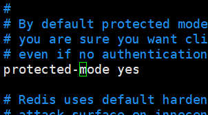

设置密码

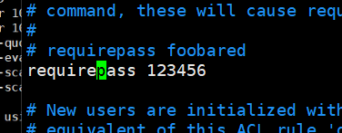


不要直接修改配置文件，会导致数据消失，因为redis 会去读取 AOF.rdb文件，而不是之前的dump.rdb,之前的数据全部再dump.rdb中。


一个操作记录 * 开始 下一个*

rdb 和 AOF 同时存在 优先读取AOF

第一次全部备份

AOF 要 config set  appendol  yes  防止数据丢失

然后再去配置文件中 设置 appendonly yes     防止重启配置丢失

127.0.0.1:6379> CONFIG set appendonly yes

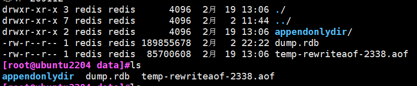

迅速做一次完全备份，把内存中的数据存到appendonly.aof.rdb

然后再去修改配置文件


AOF文件是文本文件，实时备份，可以通过修改AOF 文件恢复数据，比如删除AOF 中的 误操作

假如我们使用 flushall  dump.rdb 文件会被清空，而aof中rbd不会删除只是记录执行操作


老版本可以指定文件名，新版只能指定文件夹名称，因为新版就是一个文件下多个文件

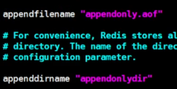


**AOF 重写(整理文件)**

AOF的日志文件是不断的追加，可能会存储很多无效数据，如下案例

AOF会记录无效数据

set a 1

set a 2

set a 3

set a 4

AOF 会把1 2 3 都记录 而我只要 a = 4 生效的只是 a=4 浪费空间


达到64M 开始重写，重写到50M 后又写到64M 但重写完还是64M 没有垃圾

自动扩展到 100%  64x2 

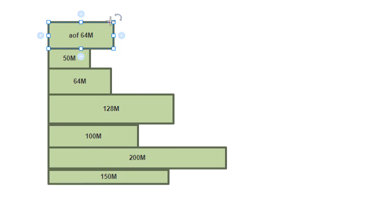

禁用 命令

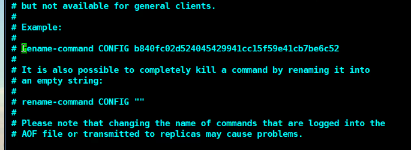


### 消息队列

比如我们下订单时，要有支付成功的信息提示，如果不用消息队列 他们时一套程序 支付成功的信息不发送成功那么我们就不能下订单

解耦  用户下订单直接完成  并发送消息到队列中， 消息通知功能等待队列消息 并拿取 发送

完成解耦，你消息发不发没关系我订单成功了，发消息失败是你们的事情


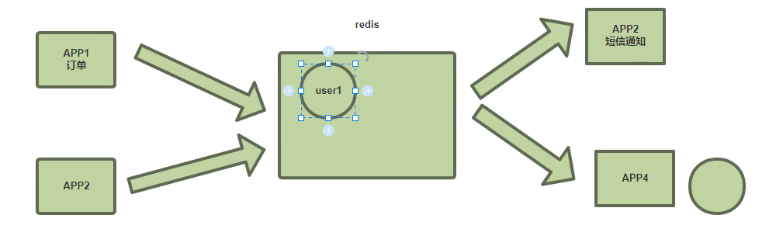


### 高可用

#### 主从复制

从节点数据会被清空，确定是否有数据要备份

主节点 从节点密码尽量一样  因为从节点要升级为主节点 如果密码不一样，升级为主节点后程序无法通过旧密码连接redis

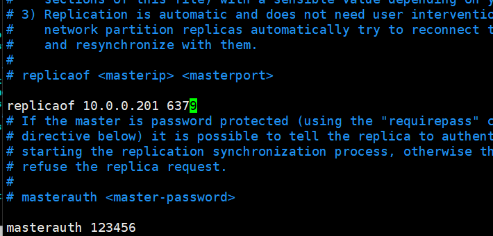


写上主节点的IP port  密码


主节点 必须开启持久化

如果主节点你没开，主节点重启数据全丢，

然后主节点重启，从节点会完全同步，但是主节点数据是空的，那么从节点将全被覆盖


不论主节点还是从节点都要设置 密码和登录密码最好都一样

防止主节点宕机恢复 变成从节点 但是连接不到新主节点

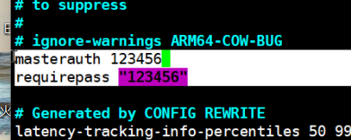

主节点挂了  重启后 Slave会执行一次全量备份

Slave 挂了 重启后执行增量备份


假如目前的主节点挂了   我们挑选一个数据较新的Slave节点，升级为主节点(选定 202 为新主)

1 取消previous的COPY关系  并且把其他Slave节点的主节点修改为新主

手动的方法比较笨，而且有自动化方案


手动切换主节点  连接26379

sentnel failover mymaster 


哨兵模式 

解决主从复制的单点问题和故障切换 sentinel 自身也要高可用

sentinel 可以监控多组主从集群 

客户端 连接 sentinel 告诉客户端连接那个 redis

Clilent 通过 sentinel 间接连接 redis


三台服务器   redis + sentinel  X 3 


redis 本身就是 setntinel  但是我们还得需要一个启动文件单独启动sentinel 不然就和redis冲突了

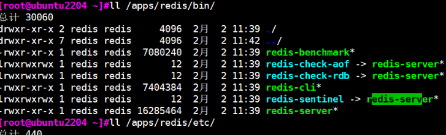


```bash
#先配置好主从 配置主从时 这两项为了防止重启服务丢失尽量写在配置i文件中
requirpass “123456”
masterauth 12345
```

配置哨兵 

```bash
#copy 配置文件
cp /usr/local/src/redis-7.2.4/sentinel.conf  /apps/redis/etc/sentinel.conf
#修改配置
pidfile /apps/redis/run/redis-sentinel.pid
logfile "/apps/redis/log/sentinel.log"

#集群名称、当前主节点、所有sentinel半数以上，一半以上认为挂了 就故障转移
sentinel monitor mymaster 10.0.0.201 6379 2
#这个集群中所有节点的密码 要修改主从角色的关系，所以要密码
sentinel auth-pass mymaster 123456

sentinel down-after-milliseconds mymaster 3000 #故障3秒 就转移


#配置完成后注意目录的权限
chown -R redis.redis /apps/redis/ 

sentinel 要修改配置文件修改主从配置所以要给他对应目录的权限，此目录的权限为 redis 把他们全设置为redis，用reids用户启动 sentinel程序
```


**编写启动文件**

```bash
#redis 对这个目录有权限我们给他全加上redis属组 然后用redis身份启动sentinel
vim /lib/systemd/system/redis-sentinel.service
[Unit]
Description=Redis Sentinel
After=network.target
[Service]
ExecStart=/apps/redis/bin/redis-sentinel /apps/redis/etc/sentinel.conf --supervised systemd
ExecStop=/bin/kill -s QUIT $MAINPID
User=redis
Group=redis
RuntimeDirectory=redis
Mode=0755
[Install]
WantedBy=multi-user.target

#所有节点都要写
scp /lib/systemd/system/redis-sentinel.service  10.0.0.202:/lib/systemd/system/redis-sentinel.service
scp /lib/systemd/system/redis-sentinel.service  10.0.0.203:/lib/systemd/system/redis-sentinel.service

#sentinel配置文件所有节点都要 
	（（此配置文件一定要在服务启动之前复制，因为启动服务后此配置文件会被修改））
 		修改中的myID 不能重复
rsync -a  /apps/redis/etc/sentinel.conf 10.0.0.202:/apps/redis/etc/sentinel.conf
rsync -a  /apps/redis/etc/sentinel.conf 10.0.0.203:/apps/redis/etc/sentinel.conf
#以访万一 所有节点的属性重新设置
chown -R redis.redis /apps/redis/ 

登录所有节点查看主从同步是否正常 

systemctl daemon-reload
systemctl enable --now redis-sentinel.service


#登录setntienl查看信息
[root@ubuntu2204 ~]#redis-cli -p 26379
127.0.0.1:26379> info

#查看发现senttinel自动修改我们配置文件
cat /apps/redis/etc/sentinel.conf 
# Generated by CONFIG REWRITE
supervised systemd
latency-tracking-info-percentiles 50 99 99.9
user default on nopass sanitize-payload ~* &* +@all
sentinel myid 9350063f8756bb4accc2a8c3cbabc6a44314b73f
sentinel config-epoch mymaster 0
sentinel leader-epoch mymaster 0
sentinel current-epoch 0

sentinel known-replica mymaster 10.0.0.202 6379

sentinel known-replica mymaster 10.0.0.203 6379

sentinel known-sentinel mymaster 10.0.0.203 26379 f0753bbef8b1c51ccbfe53074d6213742cf89066

sentinel known-sentinel mymaster 10.0.0.202 26379 8e87470ead30305570b65970b6ebeaa1a5f0120e
```


观察日志

```bash
113257:X 19 Feb 2024 22:54:23.295 # +sdown master mymaster 10.0.0.201 6379
113257:X 19 Feb 2024 22:54:24.482 * Sentinel new configuration saved on disk
113257:X 19 Feb 2024 22:54:24.482 # +new-epoch 1
113257:X 19 Feb 2024 22:54:24.485 * Sentinel new configuration saved on disk
113257:X 19 Feb 2024 22:54:24.485 # +vote-for-leader 8e87470ead30305570b65970b6ebeaa1a5f0120e 1
113257:X 19 Feb 2024 22:54:25.422 # +odown master mymaster 10.0.0.201 6379 #quorum 3/2
113257:X 19 Feb 2024 22:54:25.422 * Next failover delay: I will not start a failover before Mon Feb 19 23:00:24 2024
113257:X 19 Feb 2024 22:54:25.438 # +config-update-from sentinel 8e87470ead30305570b65970b6ebeaa1a5f0120e 10.0.0.202 26379 @ mymaster 10.0.0.201 6379

113257:X 19 Feb 2024 22:54:25.438 # +switch-master mymaster 10.0.0.201 6379 10.0.0.203 6379

113257:X 19 Feb 2024 22:54:25.439 * +slave slave 10.0.0.202:6379 10.0.0.202 6379 @ mymaster 10.0.0.203 6379
113257:X 19 Feb 2024 22:54:25.439 * +slave slave 10.0.0.201:6379 10.0.0.201 6379 @ mymaster 10.0.0.203 6379
113257:X 19 Feb 2024 22:54:25.442 * Sentinel new configuration saved on disk
113257:X 19 Feb 2024 22:54:28.472 # +sdown slave 10.0.0.201:6379 10.0.0.201 6379 @ mymaster 10.0.0.203 6379

```


redis-cli -p 26379

手动切换 master  < sentinel failover  namecluster>

我们可以调整优先级干选拔新主的结果

vim /apps/redis/etc/redis.conf

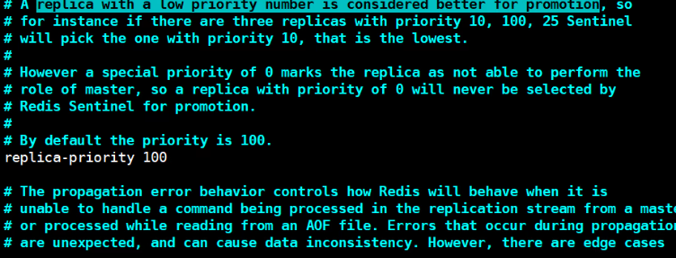


动态修改

```bash
127.0.0.1:6379> CONFIG get replica-priority 
1) "replica-priority"
2) "100"
127.0.0.1:6379> CONFIG set replica-priority 50 #当前203主  我把201优先级修改为50
OK
#切换主节点  验证优先级 
redis-cli -p 26379
sentinel failover  mymaster
```


### Redis Cluster

一个 Redis Cluster包含16384（0~16383）个哈希槽（补充：[为什么redis集群的最大槽数是16384个？](https://www.cnblogs.com/frankcui/p/15354682.html)），存储在Redis Cluster中的所有键都会被映射到这些slot中，集群中的每个键都属于这16384个哈希槽中的一个。按照槽来进行分片，通过为每个节点指派不同数量的槽，可以控制不同节点负责的数据量和请求数.

当前集群有3个节点,槽默认是平均分的:

- 节点 A （6381）包含 0 到 5499号哈希槽.
- 节点 B （6382）包含5500 到 10999 号哈希槽.
- 节点 C （6383）包含11000 到 16383号哈希槽.


我们看到的是master节点在 Redis Cluster中的实现时，都存有所有的路由信息。
当客户端的key 经过hash运算，发送slot 槽位不在本节点的时候：

- （1）如果是非集群方式连接，则直接报告错误给client，告诉它应该访问集群中那个IP的master主机。
- （2）如果是集群方式连接，则将客户端重定向到正确的节点上。

注意这里并不是127.0.0.1:7001 帮client去连接127.0.0.1:7003获取数据的，而是将客户端请求重定向了。


哨兵模式 可以解决单点模式，也可以解决故障转转，但始终是一个主节点写入服务，一个主顶不住高并发

多主架构，

集群使用公式slot=CRC16（key）/16384来计算key属于哪个槽，其中CRC16(key)语句用于计算key的CRC16 校验和

 固定算法  CRC16（key）=  n  %16384 = 0--16383 

提前约定好 0-n是个节点  我们现有三个节点 16384/3  每个节点放三分之一的槽位


缺点： 成本较高，不支持多数据库、从节点只能备份

每个主都有一个从 备份数据 

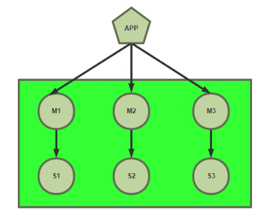

### 注意事项

保证环境干净，不能有哨兵，哨兵会自动选举，Cluster也会自动选举	冲突

redis 版本一致

硬件配置


#### 准备环境

10.0.0.201	10.0.0.204

10.0.0.202	10.0.0.205

10.0.0.203	10.0.0.206

所有节点部署 redis


修改配置 文件

```bash
也可以修改一台 拷贝到其他节点上
#六个节点都要修改
sed -i.bak  -e '/masterauth/a masterauth 123456' -e '/# cluster-enabled yes/a cluster-enabled yes' -e '/# cluster-config-file nodes-6379.conf/a cluster-config-file nodes-6379.conf' -e '/cluster-require-full-coverage yes/a cluster-require-full-coverage no' /apps/redis/etc/redis.conf

#systemctl enable --now  redis
#systemctl restart redis


#创建集群
redis-cli -a 123456  --cluster create 10.0.0.201:6379   10.0.0.202:6379    10.0.0.203:6379   10.0.0.204:6379   10.0.0.205:6379   10.0.0.206:6379  --cluster-replicas 1 
前三个IP是Master 后三个IPslave 随机配对 
--cluster-replicas 1  一个mster 只能能有一个slave
主从节点互为主备 故障恢复后变成从节点
redis-cli -a 123456 --cluster check 10.0.0.201:6379

#单机模式连接，写入数据时可能算出的值匹配对应的槽位不在本机，那么此时会报错让我们连接到对应的节点
redis-cli -a 123456 
127.0.0.1:6379> set a 1
(error) MOVED 15495 10.0.0.203:6379

#从节点只能用来 备份和故障转移  不能写入和查看 

#开启集群模式 CRC16计算后自动匹配  重定向到对应槽位的主机
[root@ubuntu2204 ~]#redis-cli -a 123456 -c 
Warning: Using a password with '-a' or '-u' option on the command line interface may not be safe.
127.0.0.1:6379> set python 3
-> Redirected to slot [7252] located at 10.0.0.202:6379
OK
10.0.0.202:6379> set golang 3
OK
10.0.0.202:6379> set java  3
-> Redirected to slot [858] located at 10.0.0.205:6379
OK
10.0.0.205:6379> 
```


每个槽位里可能存多个数据 

0开始---16383个槽位

### 扩容

在三主三从的基础上再加一主一从   4

重新分配槽位  

在原本的槽位上分一部分给新节点，分多少 16384/4   因为本来三主，现在4主。

不用考虑数据的问题，数据在槽位里面，槽位重新分别配走.


207 208配置集群模式

```bash
sed -i.bak  -e '/masterauth/a masterauth 123456' -e '/# cluster-enabled yes/a cluster-enabled yes' -e '/# cluster-config-file nodes-6379.conf/a cluster-config-file nodes-6379.conf' -e '/cluster-require-full-coverage yes/a cluster-require-full-coverage no' /apps/redis/etc/redis.conf


#添加新节点到扩容的集群
redis-cli -a 123456 --cluster add-node 10.0.0.207:6379  <当前任意集群节点>:6379
#观察到该节点已经加入成功，但此节点上没有slot位,也无从节点，而且新的节点是master
[root@redis-node1 ~]#redis-cli -a 123456 --cluster info  10.0.0.207:6379
 Warning: Using a password with '-a' or '-u' option on the command line interface 
may not be safe.
 10.0.0.8:6379 (cb028b83...) -> 6672 keys | 5461 slots | 1 slaves.
 10.0.0.68:6379 (d6e2eca6...) -> 0 keys | 0 slots | 0 slaves.#没有槽位
 10.0.0.48:6379 (d04e524d...) -> 6679 keys | 5462 slots | 1 slaves.
 10.0.0.28:6379 (d34da866...) -> 6649 keys | 5461 slots | 1 slaves.
 [OK] 20000 keys in 5 masters
#查看集群状态
redis-cli -a 123456 CLUSTER INFO


#分配槽位
#redis-cli -a 123456 --cluster reshard  <当前任意集群节点>:6379
分配多少 只需要给主节点分配 16384/4

分配到那个节点的id 

从那个节点上分配槽位给新的节点  all表示所有有槽位的节点 上平均分配出4096个槽位给207新节点
#确定slot分配成功
[root@redis-node1 ~]#redis-cli -a 123456 --cluster check <集群任意IP>:6379
 10.0.0.8:6379 (cb028b83...) -> 5019 keys | 4096 slots | 1 slaves.
 10.0.0.68:6379 (d6e2eca6...) -> 4948 keys | 4096 slots | 0 slaves.
 10.0.0.48:6379 (d04e524d...) -> 5033 keys | 4096 slots | 1 slaves.
 10.0.0.28:6379 (d34da866...) -> 5000 keys | 4096 slots | 1 slaves

#添加Slave208节点给207
1.加进来变成然后改成备用
2.加入集群并变成slave

redis-cli -a 123456 --cluster add-node 10.0.0.208:6379 <任意集群节点>:6379 --cluster-slave   --cluster-master-id  <作为谁的slave 写上他的ID> 比如是207的slave 就写上这集群中207的ID
#查看当前状态
redis-cli -a 123456 --cluster check 10.0.0.201:6379
10.0.0.8:6379 (cb028b83...) -> 5019 keys | 4096 slots | 1 slaves.
 10.0.0.68:6379 (d6e2eca6...) -> 4948 keys | 4096 slots | 1 slaves.
 10.0.0.48:6379 (d04e524d...) -> 5033 keys | 4096 slots | 1 slaves.
 10.0.0.28:6379 (d34da866...) -> 5000 keys | 4096 slots | 1 slaves.
 
 
 #redis-cli  -a 123456 -h 10.0.0.8 --no-auth-warning cluster info
 cluster_state:ok
 cluster_slots_assigned:16384
 cluster_slots_ok:16384
 cluster_slots_pfail:0
 cluster_slots_fail:0
 cluster_known_nodes:8   
#8个节点
cluster_size:4          
#4组主从
cluster_current_epoch:11
 cluster_my_epoch:10
 cluster_stats_messages_ping_sent:1810
 cluster_stats_messages_pong_sent:1423

```

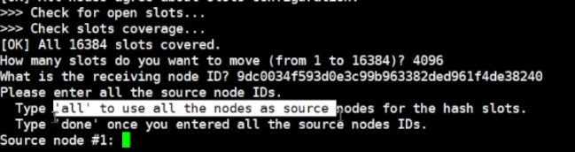


### 缩容

```bash
换多少

还给谁
从谁还

还完槽位  207 208 也就是后添加的一主一从换变成某主节点的两从
删除 207 208


#连接到任意集群节点，#最后0--1364个slot从10.0.0.207移动到第一个master节点10.0.0.201上
redis-cli -a 123456 --cluster reshard 10.0.0.201:6379
How many slots do you want to move (from 1 to 16384)? 1365 #共4096/3分别给其它三个
What is the receiving node ID? d34da8666a6f587283a1c2fca5d13691407f9462 #master 10.0.0.201的id  这里写要还给谁 接收槽位的目标ID
Please enter all the source node IDs.
  Type 'all' to use all the nodes as source nodes for the hash slots.
  Type 'done' once you entered all the source nodes IDs.
 Source node #1: cb028b83f9dc463d732f6e76ca6bbcd469d948a7 #输入要删除节点10.0.0.207的ID
 Source node #2: done
从207上拿出1365个槽位，填写要删除的节点ID
把207ID节点上的1365个槽位重新分配给201id节点
 
#连接到任意集群节点，#5461--6826个slot从10.0.0.207移动到第一个master节点10.0.0.202上
redis-cli -a 123456 --cluster reshard 10.0.0.201:6379
How many slots do you want to move (from 1 to 16384)? 1366 #共4096/3分别给其它三个
What is the receiving node ID? <master 10.0.0.202的id  这里写要还给谁 接收槽位的目标ID>
 Source node #1: cb028b83f9dc463d732f6e76ca6bbcd469d948a7 #输入要删除节点10.0.0.207的ID
 Source node #2: done
从207上拿出1365个槽位，填写要删除的节点ID 把207ID节点上的1365个槽位重新分配给202id节点


#连接到任意集群节点，#10923--12287个slot从10.0.0.207移动到第一个master节点10.0.0.203上
redis-cli -a 123456 --cluster reshard 10.0.0.201:6379
How many slots do you want to move (from 1 to 16384)? 1365 #共4096/3分别给其它三个
What is the receiving node ID? <master 10.0.0.202的id  这里写要还给谁 接收槽位的目标ID>
 Source node #1: cb028b83f9dc463d732f6e76ca6bbcd469d948a7 #输入要删除节点10.0.0.207的ID
 Source node #2: done
从207上拿出1365个槽位，填写要删除的节点ID 把207ID节点上的1365个槽位重新分配给202id节点

#查看集群信息
redis-cli -a 123456  -h 10.0.0.201 --no-auth-warning cluster info
 cluster_state:ok
 cluster_slots_assigned:16384
 cluster_slots_ok:16384
 cluster_slots_pfail:0
 cluster_slots_fail:0
 cluster_known_nodes:8  #集群中8个节点
cluster_size:3         
#少了一个主从的slot
 cluster_current_epoch:16
 cluster_my_epoch:13
 cluster_stats_messages_ping_sent:3165
 cluster_stats_messages_pong_sent:2489
 
发现207/208没有槽位而且都变成从节点
删除这两个节点
redis-cli -a 123456 --cluster del-node <任意集群节点的IP>:6379  <要删除节点的ID>

redis-cli -a 123456 --cluster del-node 10.0:6379 cb028b83f9dc463d732f6e76ca6bbcd469d948a7

删除后的节点关闭集群模式还可以作为单机使用
```


观察此图发现，后加入进群的节点 slots并不连续，说明这三段来不同的节点，我们要把这三段还给之前的节点

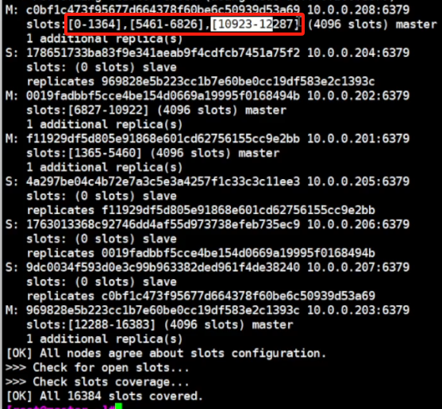


#### 把已有数据导入到新集群内

```bash
导入的时候没有输入密码的选项
导入前备份
#清空密码 关闭保护模式
开导
#还原保护，和密码


#动态修改 临时取消需要导入的主机的密码和保护模式
redis-cli -h 10.0.0.200 -p 6379 -a 123456 config set protected-mode no
redis-cli -h 10.0.0.200 -p 6379 -a 123456  --no-auth-warning  CONFIG SET requirepass ""

#动态修改 (暂时关闭保护模式，和密码)
redis-cli -a 123456 config set protected-mode no
redis-cli -p 6379 -a 123456  --no-auth-warning  CONFIG SET requirepass ""


#导入
redis-cli --cluster import 10.0.0.201:6379 --cluster-from 10.0.0.200:6379 --cluster-copy --cluster-replace

我们要把200上的旧数据导入到201这个新集群中
后面ID 是数据源的IP 
选项的意思是 如果有相同Key就覆盖


#动态修改 还原配置
#在所有节点(源节点和集群节点)还原Redis密码认证
redis-cli  -p 6379  --no-auth-warning  CONFIG SET requirepass "123456"
#还原配置protected-mode
redis-cli -a 123456 config set protected-mode yes
```

